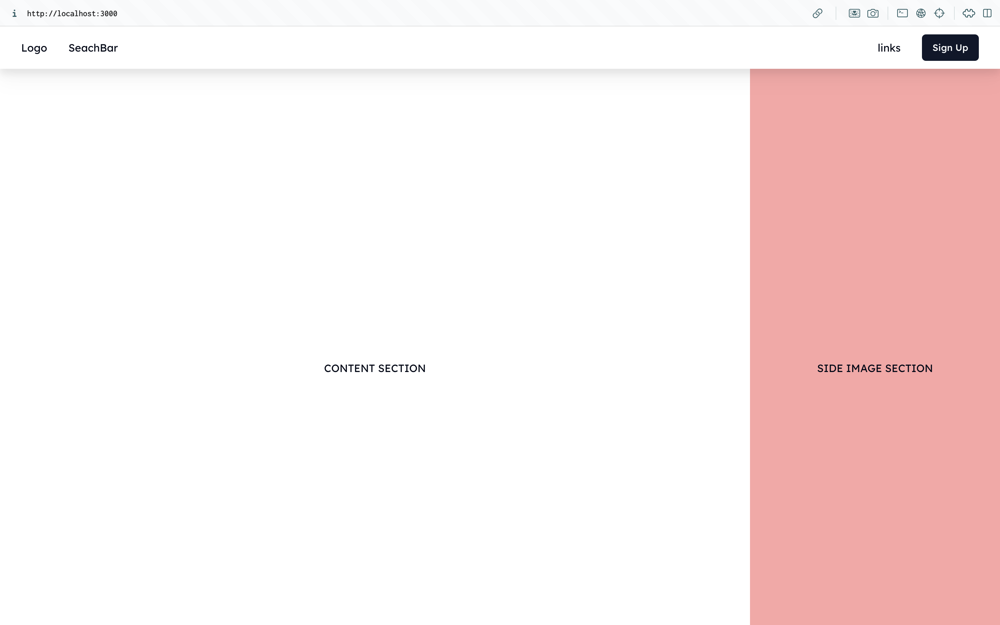

# Migaku Learning Platform 📖

<p>This project submitted in partial fulfillment of
the requirements for ITCS212 Web Programming, Faculty of Information Communication and Techonology,  Mahidol University
</p>

### Project/Repository Description
- This project aims to simulate the development process of a full-stack E-Learning platform open to students and teachers. This platform is equipped with a wide range of features. 
- **This repository hold only client side app**

#### Features

- **For Student**
  - Browse all available courses taught by instructors.
  - Search courses by course name, instructor name, or category.
  - Sort search results in ascending or descending order.
  
- **For Instructor**
  - Exclusive access to the course management tab.
  - Publish, update, and delete courses.
  - Manage users in the "users" tab, including deleting accounts  or updating permissions.


### Key Points
- Flexible learning experience for students.
- Easy course publishing for instructors.
- Follows best UX/UI practices for enhanced user experience.
- Responsive design for accessibility across all devices.

### Setup Instruction
<!-- setup instruction info  -->
1. Clone project
```bash
git clone https://github.com/Yoboba/ict-itcs212-migaku-client.git
```
2. install dependencies from package.json
```bash
npm install
```
3. try run on development stage
```bash
npm run dev
```

### Page Examples
- Landing Page

